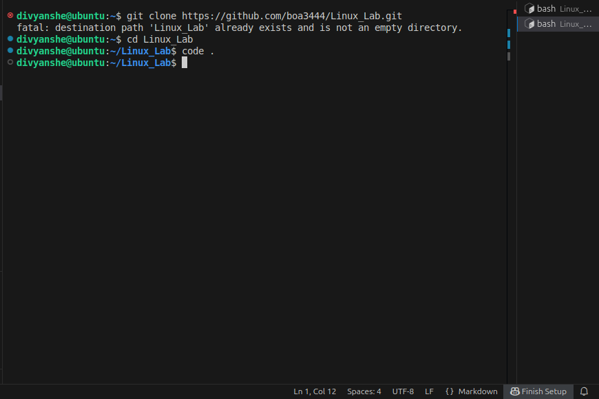
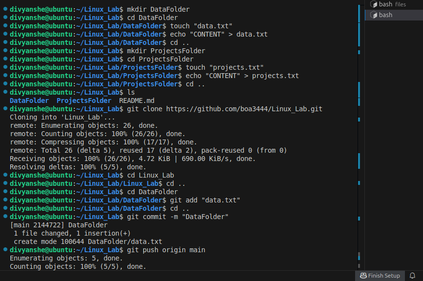
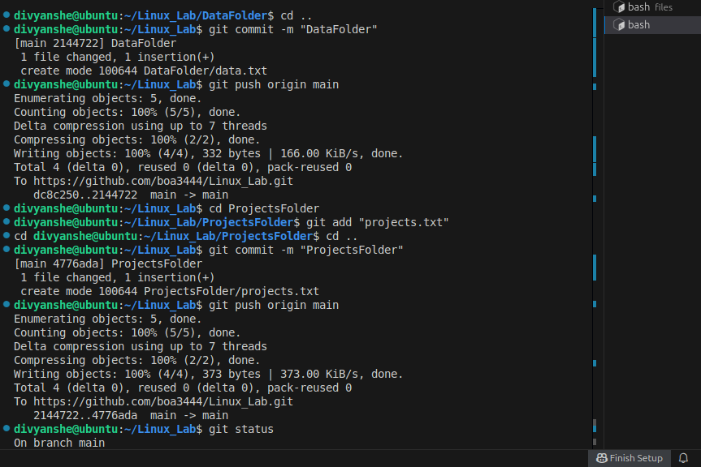

# Experiment2:

Aim : Basic Linux Terminal Commands (like mkdir , used to create directories through terminal)

# Prerequisites:

1. Ensure you have an IDE, cmd or a terminal to run codes in.
2. You have a Linux OS or virtualbox with Ubuntu, Debian , etc.

# Command: mkdir
Statement: Creates directories in specified paths.

Example: mkdir DataFolder

# Bash Script

'''bash
#!/bin/bash

mkdir data
echo "Just an example"

# Test2 snippets

![Snippet of output] (images/lastcode.png)

 
