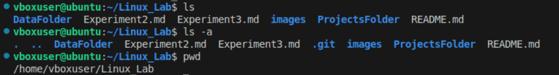

<!-- ### Heading
## Heading
# Heading -->

# Experiment3
## Objective:

**Understanding basic commands**

## pwd command
>pwd  
>
**Output Example:**  
~/Desktop/Linux_Lab

## ls command  
>ls  

**Output of ls:**
#image here

### ls flags
## ls command  
ls command helps us to view all the files and folders in our current directory.  
Flag -a list down all file and folder including the ones that are hidden.  
>ls -la   

**Output of ls -la:**

