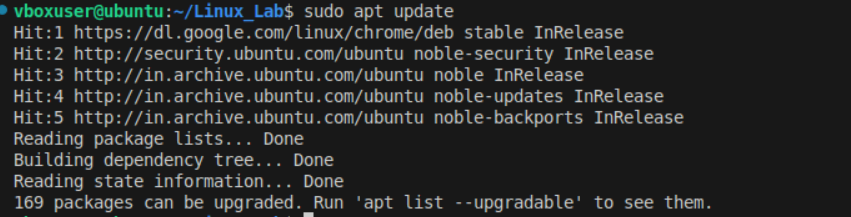
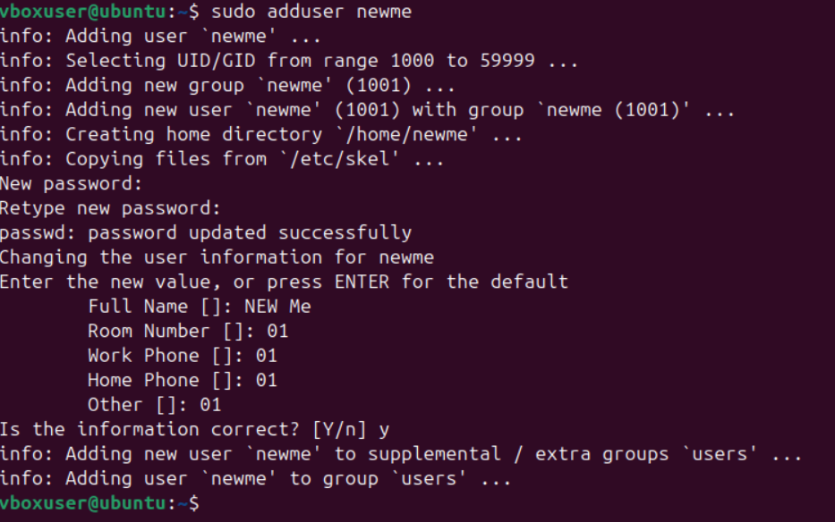
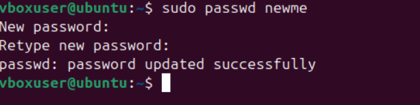
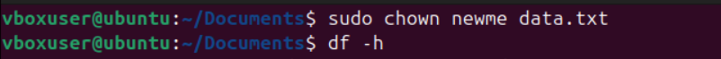
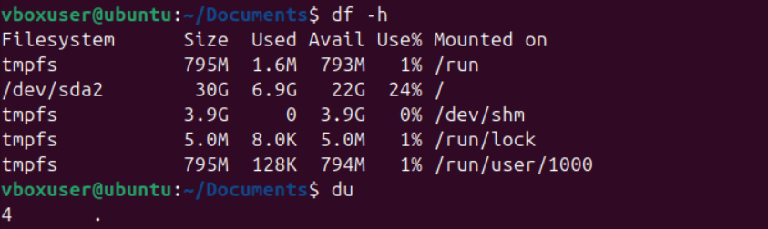
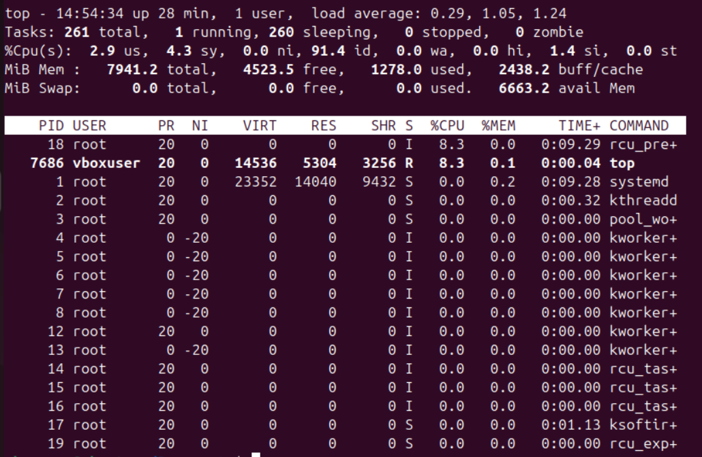
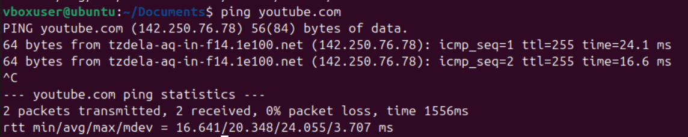
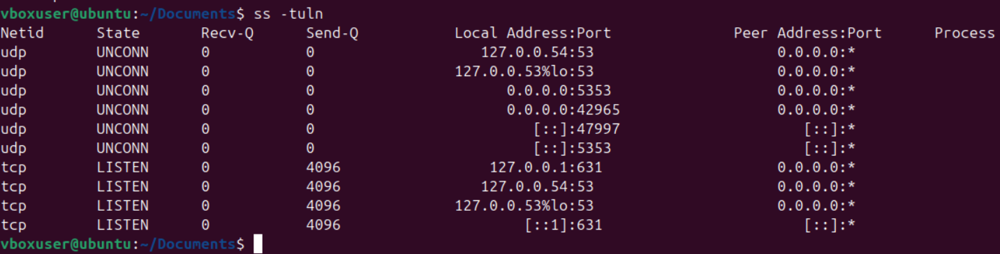
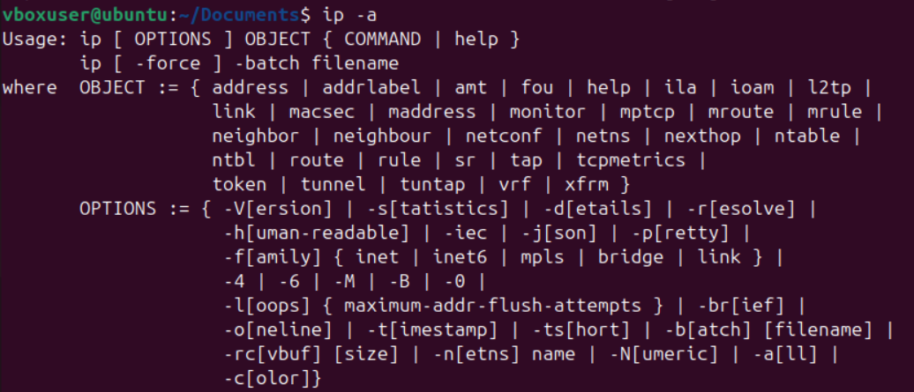
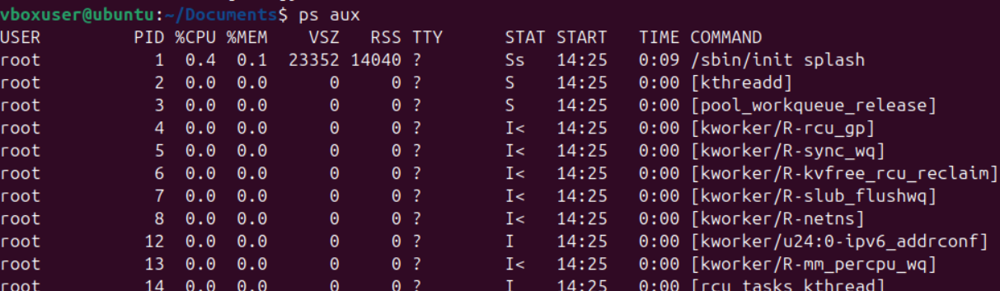

# Experiment 3 -- Part 2.  
## Objective:
To study from intermediate to advanced terminal commands.

# 1. `sudo` command
(SuperUser DO) allows you to run commands with root privileges.

Example: 
```bash 
sudo apt install git
sudo apt update
```


# 2. User Management commands  

### (Linux/macOS only)
### 1. `adduser` command
``` bash
sudo adduser username
```
You will have to set up the password and other prominent stuff in this step.

### 2. `passwd` command
``` bash
sudo passwd username

```

### 3. `usermod` command: To modify the user's settings
To add a username to a groupname

```bash
sudo usermod -aG groupname username
```

### 4. `deluser` 
This deletes the user but not completely:
```bash
sudo deluser username
```

To completely remove the user's home directory, files etc:
```bash
sudo deluser --remove-home username
```

# 3. File Permissions with `chmod` and `chown` commands
### 1. `chmod` – Change File Permissions
```bash
chmod [permissions] file
```

Example:

```bash
chmod 700 file.txt
Owner: read/write/execute, Group: no permission, Others: no permission
```

Reference for numbers:
 Number | Permission             

 7  ➡️ read + write + execute   
 6  ➡️ read + write           
 5  ➡️ read + execute         
 4  ➡️ read only              
 0  ➡️ no permission  

 

### 2. `chown` – Change File Owner
Syntax:
```bash
sudo chown user:group file
```        
Example:
```bash
chown divi myfile.txt
```


# 4. Disk Usage & System Info
### 1.`df` – Disk Space Usage
displays disk space usage in a human-readable format

syntax:  
```bash
df –h
```


### 2. `du` - Directory Size
displays the folder size
syntax:  
du -sh folder_name


### 3.`top` command
for monitoring system processes and resource usage in real-time.  

Syntax:  
```bash
top
```
**Note**: Press 'q' to quite the command.

Alternate command:  
```bash
htop
```

# 5. Networking Commands
### 1. `ping` – Check Network Connectivity

Example:  
```bash
ping youtube.com
```
**NOTE** : Press `Ctrl` + `C` to quit.

### 2. `netstat` – Show Active Network Connections
Syntax:
```bash
netstat -tuln
```
**OR**
```bash
ss -tuln
```

### 3. `ifconfig` or `ip` a – Show IP Address & Network Info.
syntax:  
```bash
ip a
```
```bash
ifconfig
```


# 6. Package Management
For Ubuntu/Debian (APT):
```bash
sudo apt remove git
sudo apt update
```

# 7. Process Management
### 1.`ps` – Show Running Processes
Syntax:
``` bash
ps aux
```

### 2.`kill` – Kill a Process
Syntax:
```bash
kill [PID]
```
Example:
```bash
kill 21232
```
# 8. Shutdown and Reboot

Syntax:
```bash
    sudo shutdown now        
    sudo shutdown -r now 
```


