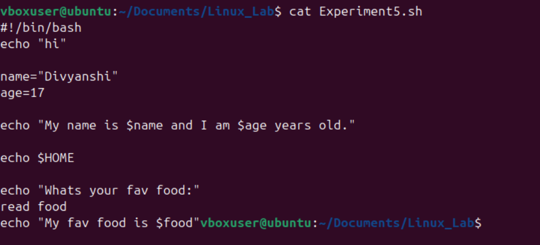

# What is a shell script?
* A **shell script** is a text file containing a series of commands written for the shell to execute.
* It automates tasks that you would normally run in the terminal.
* Example: Running multiple commands, looping through files, making backups, etc.

---

## 1. Creating Your First Shell Script

1. Open a terminal and create a file:

   ```bash
   nano hello.sh
   ```

2. Add the following content:

   ```bash
   #!/bin/bash
   # This is a simple shell script

   echo "Hello, World!"
   ```

   * `#!/bin/bash` → called a **shebang**, tells the system which shell to use.
   * `echo` → prints text to the screen.
   * `#` → marks a comment.

3. Save and exit (`CTRL+O`, `CTRL+X` in nano).

4. Make it executable:

   ```bash
   chmod +x hello.sh
   ```

5. Run it:

   ```bash
   ./hello.sh
   ```

✅ Output should be:

```
Hello, World!
```

---


## 2. Variables in Shell

You can store data in variables:

```bash
#!/bin/bash

name="Vibhu"
age=37

echo "My name is $name"
echo "I am $age years old"
```

⚠️ Note: **No spaces** around `=` when assigning values.

---


## 3. Taking User Input

```bash
#!/bin/bash

echo "Enter your name:"
read username

echo "Hello, $username! Welcome to shell scripting."
```

* `read` → takes input from the user.
* `$username` → retrieves the value.

---


## 4. Conditional Statements (if-else)

```bash
#!/bin/bash

echo "Enter a number:"
read num

if [ $num -gt 10 ]
then
    echo "The number is greater than 10"
else
    echo "The number is 10 or smaller"
fi
```

* `-gt` → greater than.
* Other operators: `-lt` (less than), `-eq` (equal).

---


