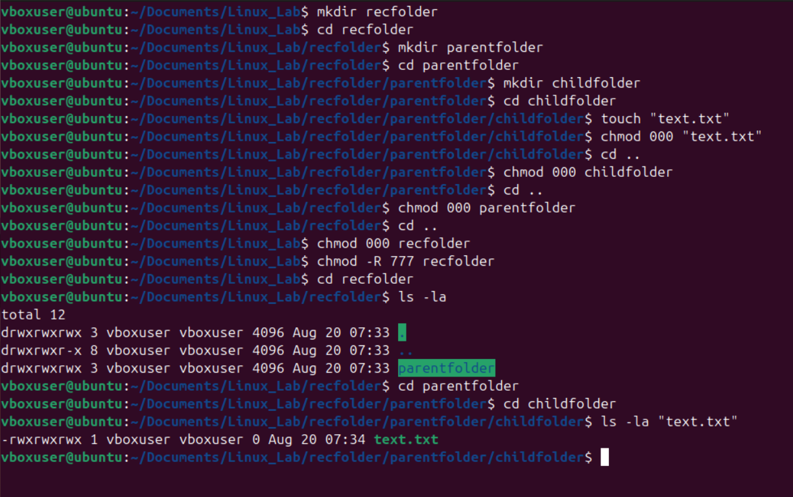

# Shell programming- using `chmod` and `chown`.

## 1. Understanding File Permissions in `Linux`:

**Each file/directory in Linux has:**

Owner → The user who created the file.  
Group → A group of users who may share access.  
Others → Everyone else.  
Permission Types:   
r → Read (4 in numeric)  
w → Write (2 in numeric)  
x → Execute (1 in numeric)  

**The syntax  of permissions:**
```bash
ls -la
Output : -rwxr-xr--
```
##IMage

## 2. chmod – Change File Permissions

Syntax:
```bash
chmod 741 file.txt

Meaning:
7 -> can read,write,execute for users
4 -> can read only for groups
1 -> can only execute for others

```
### (A) Numeric (Octal) Method
Each permission is represented as a number:

Read = 4  
Write = 2  
Execute = 1  

Add them up:  
```bash
7 = rwx  
6 = rw-  
5 = r-x  
4 = r--  
0 = ---
  
```

### (B) Symbolic Method
Use u (user/owner), g (group), o (others), a (all). Operators:

+ `+`→ Add permission
+ `-`→ Remove permission
+ `=`→ Assign exact permission  

#IMagee

### (C) Recursive Changes
`chmod -R 755 /mydir`

**`-R` → applies changes recursively to all files/subdirectories.**  


## 3. `chown` – Change File Ownership
Syntax:  
```bash
chown [options] new_owner:new_group filename
```

Example:  
```bash
chown newon:group2 data.txt
Meaning:
Change ownership to newon and group to group2
```
##Imagee

## 4. Combination of all concepts.
```bash
chmod 700 project.sh        
chmod u+x,g-w project.sh   
chown root:admin project.sh
```
