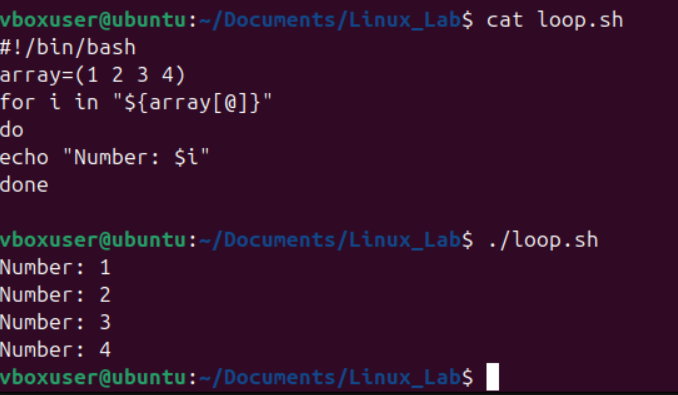

## 1.  What is a Shell Script?

* A **shell** is a command-line interpreter (e.g., `bash`, `zsh`, `sh`).
* A **shell script** is a text file with a series of commands.
* File usually has **`.sh`** extension, though not mandatory.

**Example: `hello.sh`**


```bash
chmod 777 hello.sh   # make it executable
./hello.sh
```

Output:

```
Hello, World!
```

---

## 2. 🔹 Variables

Variables store data (text, numbers, paths, etc.).

### Defining variables

```bash
name="Vibhu"
age=37
```


### Accessing variables

```bash
echo "My name is $name and I am $age years old."
```

Output:

```
My name is Divyanshi and I am 17 years old.
```

### Environment variables

```bash
echo $HOME   # home directory
echo $USER   # current user
echo $PWD    # present working directory
```

---

## 3. 🔹 User Input

Read input from user with `read`.

```bash
#!/bin/bash
echo "Enter your favorite language:"
read lang
echo "You chose $lang"
```

---
CODE:

OUTPUT:


## 4. 🔹 Conditional Statements (if-else)

```bash
#!/bin/bash
num=10

if [ $num -gt 5 ]; then
    echo "Number is greater than 5"
else
    echo "Number is less than or equal to 5"
fi
```
#image for inetegers and strings
Operators:

* `-eq` (equal)
* `-ne` (not equal)
* `-gt` (greater than)
* `-lt` (less than)
* `-ge` (greater or equal)
* `-le` (less or equal)

---
  
OUTPUT:  

## 5. 🔹 Loops

### For loop

```bash
for i in 1 2 3 4 5
do
    echo "Number: $i"
done
```

Or use a range:

```bash
for i in {1..5}
do
    echo "Iteration $i"
done
```

### While loop

```bash
count=1
while [ $count -le 5 ]
do
    echo "Count: $count"
    ((count++))   # increment
done
```

### Until loop

Runs until condition becomes true.

```bash
x=1
until [ $x -gt 5 ]
do
    echo "Value: $x"
    ((x++))
done
```

---

## 6. 🔹 Functions

Encapsulate reusable code.

```bash
greet() {
    echo "Hello, $1"
}

greet Vibhu
greet World
```

Output:

```
Hello, Vibhu
Hello, World
```

---

## 7. 🔹 Command Line Arguments

Access arguments passed to script:

```bash
#!/bin/bash
echo "Script name: $0"
echo "First argument: $1"
echo "Second argument: $2"
echo "All arguments: $@"
echo "Number of arguments: $#"
```

Run:

```bash
./script.sh apple banana
```

Output:

```
Script name: ./script.sh
First argument: apple
Second argument: banana
All arguments: apple banana
Number of arguments: 2
```

---

## 8. 🔹 Arrays

```bash
fruits=("apple" "banana" "cherry")

echo "First fruit: ${fruits[0]}"

for fruit in "${fruits[@]}"; do
    echo "Fruit: $fruit"
done
```

---

## 9. 🔹 Useful Commands in Scripts

* `date` → show current date/time
* `whoami` → show current user
* `ls` → list files
* `pwd` → print working directory
* `cat` → read file contents

---

## 10. 🔹 A Practical Example

**Backup script (`backup.sh`):**

```bash
#!/bin/bash
# Backup home directory to /tmp

backup_file="/tmp/home_backup_$(date +%Y%m%d%H%M%S).tar.gz"

tar -czf $backup_file $HOME

echo "Backup saved to $backup_file"
```

Run:

```bash
./backup.sh
```

---


